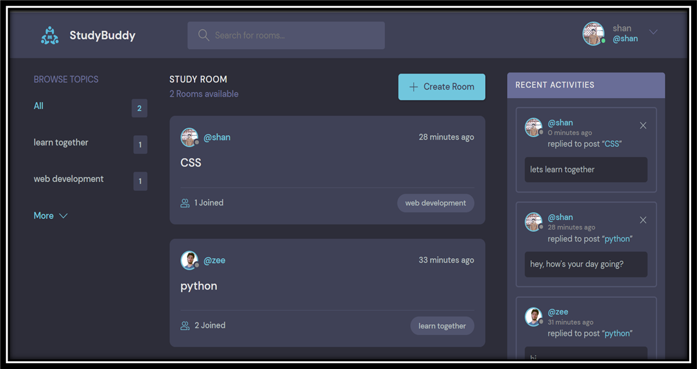
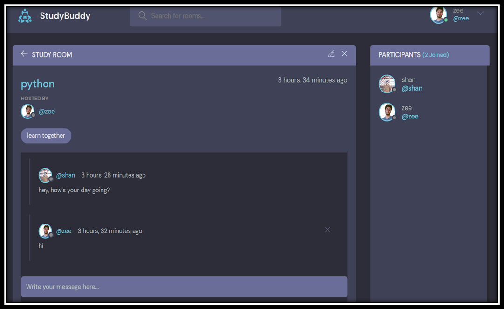
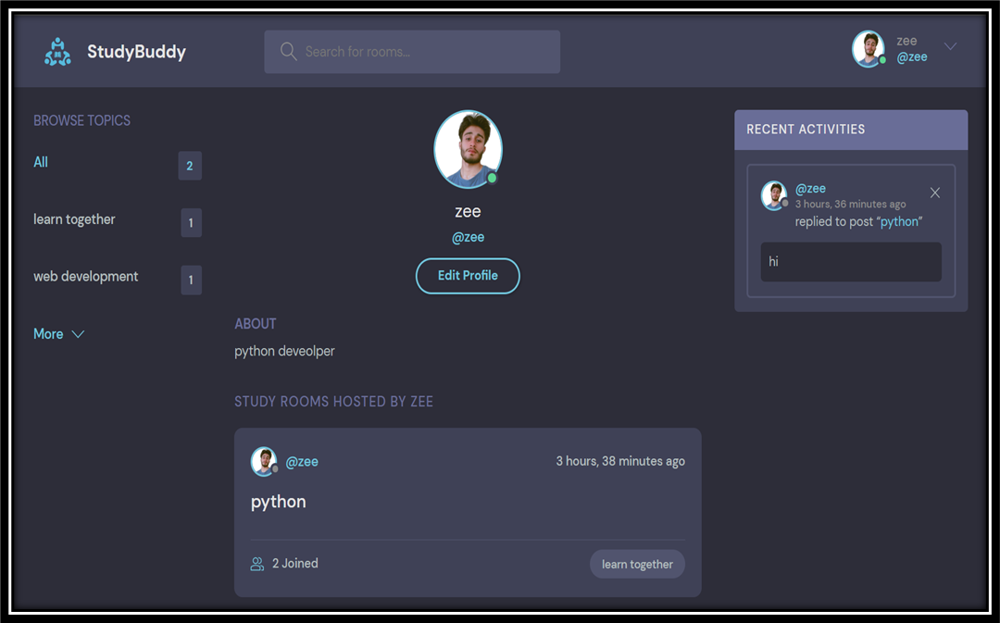

# Discord Clone (StudyBud)

Welcome to our platform, Study Bud.
 - a website that mimics Discord and is intended to promote learning and 
information exchange in a group setting. 
 - Using our platform, you can set up virtual spaces where people with similar interests may congregate, have 
conversations, exchange insightful knowledge, and learn from one another.

## Features

### Account Creation and Registration
 - Visitors are able to sign up and set up an account on the 
website.
 - With their login information, they may log in.
### Room Creation
 - To encourage conversation and study, users can construct rooms on a variety of subjects.
### Room Participation
 - Individuals can enter already-existing rooms and take part in conversational exchanges.
### Messaging
 - In order to interact with other users, users can send messages within the rooms.
### Recent Activities Log
 - It serves as a communication tool, allowing members to stay informed about ongoing activities.
### Searching
 - To search topics or discussions that you are interested in to take part. 
## Getting Started

### Prerequisites

Before running Django project with PostgresSql database, ensure you have installed dependencies given below:
```bash
pip install django
pip install psycopg2
```

### Configure Database Settings

 - You have to go to **railway.app** after login create a new database using PostgresSql database.
 - Open the settings.py file inside DiscordMain Folder and configure the DATABASES setting to use PostgresSQL.
 - Modify the ENGINE, NAME, USER, and PASSWORD fields to match your PostgresSQL configuration of railway.app database.

### Virtual environment

Create a virtual environment and activate it. (For Windows)

Navigate to Your Project Directory 
```bash
cd path\to\your\project
```

Create a Virtual Environment
```bash
python -m venv venv
```

Activate the Virtual Environment
```bash
.\venv\Scripts\activate
```

### Migrate Database

Run the following commands to apply database migrations:
```bash
python manage.py makemigrations
python manage.py migrate
```

### Run the Development Server
```bash
python manage.py runserver
```

### Installation
Clone the repository:
```
git clone https://github.com/yourusername/yourproject.git
cd yourproject
```

### Screenshots
STUDY BUDDY MAIN PAGE


STUDY ROOM


PROFILE PAGE
